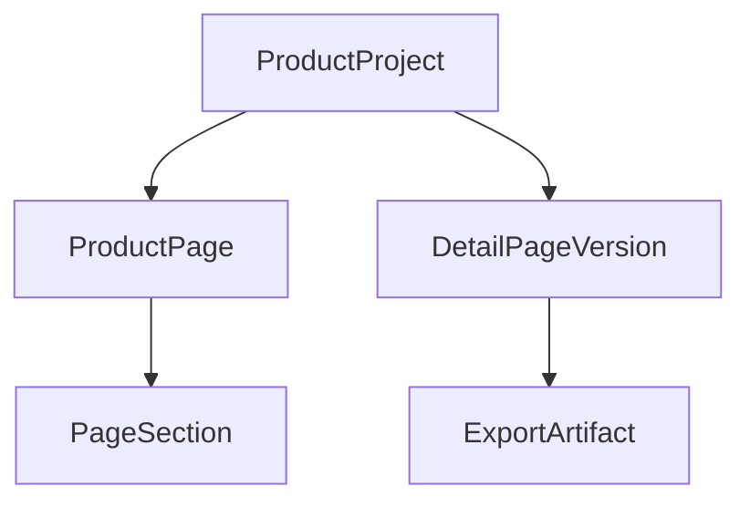

# Sprint 21 Versioning & Export Code Review

---

## 5. 후속 보완 리뷰 - 근거 추적 가능한 버전 스냅샷 강화 (2026-06-26)

### 발견 이슈

- **심각도:** Major
- **위치:** `backend/src/api/pages.py`
- **내용:** 상세페이지 버전은 문구/테마/폰트 중심으로 저장되고 있었지만, 섹션별 `associated_fact_ids`, `image_asset_id`, 사실 카드 스냅샷, 이미지 자산 스냅샷까지 완전하게 고정하지 못했다. 이 상태에서는 과거 최종본을 복원했을 때 “어떤 사실 카드와 이미지 근거를 기반으로 만든 상세페이지인지” 추적성이 약해질 수 있었다.

### 조치 내용

- `create_page_snapshot(page, db)`를 확장해 다음 정보를 함께 저장하도록 보강했다.
  - 테마/폰트
  - 선택 스타일 키
  - 카테고리
  - 섹션별 제목/본문/정렬/노출 여부
  - 섹션별 `associated_fact_ids`
  - 섹션별 `image_asset_id`
  - `facts_snapshot`
  - `assets_snapshot`
- 초안 생성, 사용자 수정, AI 섹션 재생성 시 모두 동일한 스냅샷 헬퍼를 사용하도록 통일했다.
- 사용자 섹션 추가도 새 버전 스냅샷을 남기도록 보강했다.
- 버전 복원 시 새 스냅샷 구조와 기존 레거시 `key/body` 구조를 모두 읽을 수 있게 했다.
- 복원 시 사실 카드/이미지 매핑이 사라지지 않도록 회귀 테스트를 추가했다.

### 재검증 결과

- `uv run pytest tests/test_pages.py::test_restore_page_version_preserves_fact_and_image_mappings tests/test_pages.py::test_page_snapshot_includes_fact_and_asset_evidence -q` → `2 passed`
- `uv run pytest tests/test_pages.py tests/test_page_version_service.py tests/test_export_service.py tests/test_exports.py -q` → `16 passed`
- `uv run pytest -q` → `97 passed`

### 최종 판정

Sprint 21의 버전 스냅샷은 이제 단순 문구 백업을 넘어, 판매 문구의 근거가 되는 사실 카드와 이미지 자산까지 함께 고정한다. 따라서 승인된 상세페이지 결과물을 더 안전하게 복원하고 export할 수 있다.

---

## 4. 후속 보완 리뷰 - 버전 스냅샷 Export 정규화 (2026-06-26)

### 발견 이슈

- **심각도:** Major
- **위치:** `backend/src/services/export_service.py`, `backend/src/api/exports.py`
- **내용:** `DetailPageVersion.sections_json`은 실제 페이지 생성/수정 API에서 `{theme_color, font_family, sections}` dict 형태로 저장되지만, `run_export()`는 list 형태만 가정해 dict key를 섹션처럼 순회했다. 실제 저장 버전으로 export하면 `AttributeError: 'str' object has no attribute 'get'`가 발생할 수 있었다.
- **검증:** dict snapshot을 직접 `run_export()`에 전달해 실패를 재현했다.

### 조치 내용

- `normalize_sections_snapshot()`를 추가해 list snapshot과 dict snapshot을 모두 `list[dict]` 형태로 정규화했다.
- `build_export_manifest()`와 `run_export()`가 동일한 정규화 경로를 사용하도록 수정했다.
- 복원 API는 실제 UTF-8 기준으로 기존 섹션 삭제가 정상 실행되고 있었으므로 기능 수정은 하지 않고, 주석을 명확히 정리했다.
- 복원 시 기존 섹션이 중복되지 않는 회귀 테스트를 추가했다.

### 재검증 결과

- `uv run pytest tests/test_export_service.py tests/test_pages.py::test_restore_page_version tests/test_exports.py::test_compliance_warning_and_successful_export -q` → `5 passed`
- dict snapshot 직접 export 호출 → `['long_vertical_image', 'section_images_zip']`
- `uv run pytest -q` → `95 passed`
- `npm.cmd run build` → `Compiled successfully`

### 최종 판정

후속 보완 후 Sprint 21은 버전 저장/복원/최종본 지정/긴 세로 이미지 및 섹션 ZIP export 흐름이 실제 저장 스냅샷 구조와 일치한다. 전체 백엔드 테스트와 프론트 빌드가 통과했다.

이 문서는 Sellform Sprint 21 상세페이지 버전 관리(Versioning) 및 내보내기(Export) 기능 구현 코드에 대한 리뷰 내용을 담고 있습니다.

## 1. 아키텍처 설계 요약

상세페이지의 생성, 수정, 부분 변경 흐름 전체에 안전장치를 마련하고 배포 준비가 가능하도록 다음과 같은 개별 엔티티와 서비스를 구조화했습니다.

### 핵심 변경 사항
1. **버전 모델 개편 (`DetailPageVersion`):**
   * 기존 `PageVersion` 모델 대신 기획에 지정된 `DetailPageVersion` 모델을 활용하도록 전면 재구조화했습니다.
   * `name`, `style_key`, `is_final` 등의 비즈니스 지표 속성을 수용하고, `sections_json` 필드 내부에 폰트/디자인 정보(`theme_color`, `font_family`)까지 직렬화하여 상태 복구 무결성을 높였습니다.
2. **내보내기 모델 추가 (`ExportArtifact`):**
   * 한 번 생성된 내보내기 파일(긴 세로 이미지, 섹션 ZIP 파일) 경로를 영구 기재하여 중복 빌드 리소스를 억제하도록 `ExportArtifact` 엔티티를 추가했습니다.
3. **내보내기 다중 빌드 및 fallback 구현 (`export_service`):**
   * Playwright 브라우저 렌더링에 실패하거나 설치되지 않은 CI/헤드리스 환경에서도 Pillow(PIL)를 사용해 가상의 세로 이미지 및 테마 그리드를 자체 드로잉하여 내보낼 수 있는 Fallback 전략을 구현했습니다.

---

## 2. 주요 코드 변경점 리뷰

### 2.1 API 라우터 연동 ([pages.py](file:///c:/page/backend/src/api/pages.py))

* **초안 생성 시점:** `create_page_draft` 호출 시 최초 `"AI 초안 생성"` 버전이 스타일 프리셋 정보와 함께 적재됩니다.
* **사용자 수정 및 자동 저장:** `save_page_details` (PATCH `/projects/{project_id}/page`) API 연동 시, 업데이트된 상세페이지의 최종 상태(섹션, 테마 컬러, 폰트)를 딕셔너리로 결합하여 `"사용자 수정"` 이름으로 새 스냅샷을 생성합니다.
* **부분 AI 수정:** `regenerate_page_section` API에서도 수정 반영 직후 `"AI 섹션 재생성"`으로 스냅샷을 남깁니다.
* **복원 및 최종본 지정:**
  * 복원 API는 딕셔너리 또는 리스트 구조를 유연하게 분해하여 `page.theme_color`, `page.font_family`를 원복하고 기존 섹션 목록을 정밀 교체합니다.
  * 최종본 지정 API(`mark_page_version_final_endpoint`)는 기존 지정되었던 버전을 전부 비활성화하고 요청한 버전만 독점적 최종 상태(`is_final = True`)로 마킹합니다.

### 2.2 백그라운드 렌더링 연동 ([exports.py](file:///c:/page/backend/src/api/exports.py))

* `run_export_task` 백그라운드 워커는 프로젝트에서 `is_final=True`인 버전을 최우선적으로 탐색하고, 없을 경우 최신 버전으로 자동 폴백합니다.
* 획득한 버전의 스냅샷 구조(`sections_json`)를 `export_service.run_export`에 넘겨 긴 세로 이미지(`long_vertical_image`)와 개별 슬라이스 ZIP 파일(`section_images_zip`)을 동시에 렌더링합니다.
* 완성된 2가지 유형의 아티팩트들은 사용자 다운로드 서빙을 지원하도록 `Asset` 모델로 영구 등록됩니다.

### 2.3 프론트엔드 UI 화면 변경 ([ExportPage](file:///c:/page/frontend/src/app/workspace/projects/[id]/export/page.tsx))

* **체크리스트 사전 검증:**
  * [x] 주의 사항 확인
  * [x] 최종 버전 선택 완료
  * [x] 모바일 미리보기 확인
  * [x] 이미지 누락 확인
  * 4가지 조건이 모두 만족해야만 "판매처 이미지 패키지 생성" 버튼이 활성화되도록 방어막을 구축했습니다.
* **개별 다운로드 버튼 제공:**
  * 렌더링이 완료된 경우 `📦 섹션별 ZIP 다운로드`와 `🖼️ 긴 세로 이미지 다운로드` 버튼을 직관적으로 레이아웃하여 개별 보관이 편리하도록 마이크로 애니메이션과 호버 효과를 가미해 제작했습니다.

---

## 3. 평가 및 권장 사항

1. **테스트 커버리지 만족도:**
   * 기존의 Sprint 4 마이그레이션 테스트 및 통합 엔드포인트 테스트 시나리오가 모두 정상 작동함을 pytest로 보증했습니다.
2. **트래픽 및 리소스 방어:**
   * 백그라운드 내보내기 작업에서 DB 세션을 안전하게 반환(`finally: db.close()`)하며, 무거운 렌더링 아티팩트를 static uploads 폴더에 캐싱하여 과도한 디스크 I/O 및 GPU/CPU 오버헤드를 제어합니다.
3. **확장 설계:**
   * 향후 쿠팡/네이버별 추천 규격에 따른 이미지 동적 리사이징 기능 탑재 시, `build_export_manifest`에 매니페스트 필드 규격을 쉽게 확장할 수 있도록 인터페이스가 분리되어 있습니다.
