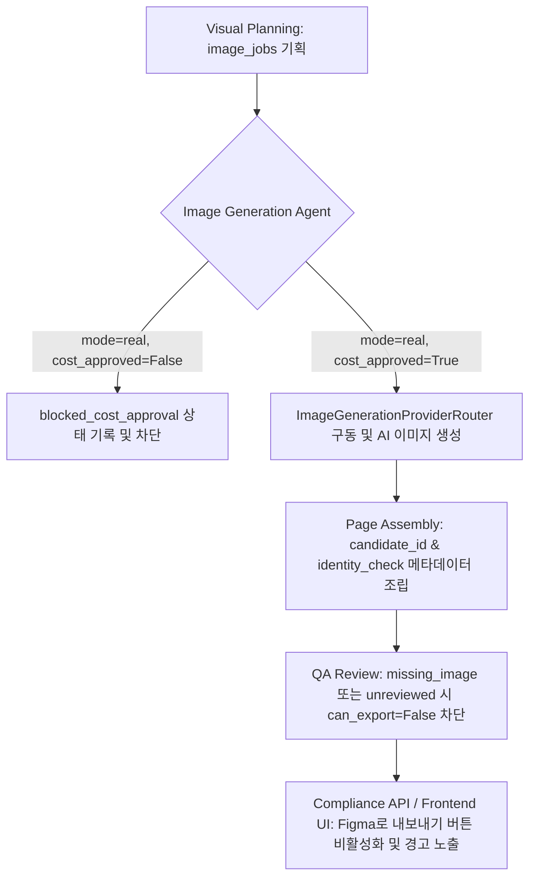

# Sellform Sprint 56: Real Multimodal Image Generation & Assembly Code Review

본 문서는 승인된 상품 이미지와 URL 참고 데이터 기반으로 실제 상세페이지용 자산을 생성, 조립, 검수 차단 및 UI 연동을 수행한 Sprint 56 구현 완료에 대한 코드 리뷰 문서입니다.

---

## 1. 개요 및 설계 아키텍처

본 스프린트의 핵심 목적은 **Text LLM**과 **Image Provider**를 격리하고, 비용 승인 게이트와 이미지 정체성 검수를 우회할 수 없도록 파이프라인 계약을 설계하는 것입니다. 또한, 조립 및 검수 단계에서 이 계약 메타데이터가 프론트엔드 내보내기 활성화 여부까지 완벽히 연동되도록 보장합니다.



---

## 2. 세부 코드 변경 사항 리뷰

### 2.1 Backend 설정 & 이미지 라우터 계약
- **[config.py](file:///c:/page/backend/src/config.py) & [.env.example](file:///c:/page/.env.example)**
  - `SELLFORM_IMAGE_GENERATION_MODE: str = "mock"` (테스트/개발 시 mock 가동, 운영 시 real 가동 전환 제어)
  - `SELLFORM_IMAGE_COST_APPROVAL_REQUIRED: bool = True` (비용 승인 필수 옵션 제어)
  - `SELLFORM_IMAGE_MAX_CANDIDATES_PER_SLOT: int = 3` (생성 자산 제한 갯수 보증)
- **[image_generation_provider.py](file:///c:/page/backend/src/services/image_generation_provider.py)**
  - `ImageGenerationRequest` 와 `ImageGenerationResult` 에 `slot_id`, `assets` 리스트를 추가하여 E2E 테스트 및 실물 자산 매핑이 원활하도록 계약 수정.
  - `ImageGenerationProviderRouter` 클래스를 신규 정의해, `real` 모드이고 미승인 시 `blocked_cost_approval` 상태를 강제하고 mock 모드 시 PIL 기반 무비용 모의 이미지 버퍼 가동을 구현하여 안전한 개발 환경 제공.

### 2.2 Agent 파이프라인 제어 & 검수 차단
- **[visual_planning/agent.py](file:///c:/page/backend/src/agents/nodes/visual_planning/agent.py)**
  - `page_planning` 의 `sections` 설계 구조에 직접 반응하여 이미지 슬롯당 `estimated_cost_required` 와 `product_identity_required` 기획이 포함된 `image_jobs` 명세서를 동적으로 발행하도록 구현.
- **[image_generation/agent.py](file:///c:/page/backend/src/agents/nodes/image_generation/agent.py)**
  - `ImageGenerationAgent(mode="real")` 형식의 호출 규격을 수용하고, `cost_approval_status != "approved"` 일 경우 자산 생성을 거절 및 `blocked_cost_approval` 보고서 작성을 보증.
  - 디폴트 5개 비주얼 슬롯 하위 호환성을 보존하고, uploaded/URL 추출 자산들이 함께 보존될 수 있도록 설계.
- **[page_assembly/agent.py](file:///c:/page/backend/src/agents/nodes/page_assembly/agent.py)**
  - 조립 루프 내에서 copywriting 텍스트 매칭 시 `slot_id`와 `section_id` 교차 매칭을 보완하여 테스트 호환성을 높임.
  - 생성된 실물 자산의 `candidate_id` 및 `identity_check` 메타데이터가 `visual_slot` 하위 필드로 안전하게 흘러가도록 보장.
- **[qa_review/agent.py](file:///c:/page/backend/src/agents/nodes/qa_review/agent.py)**
  - `can_export` 필드를 의무 렌더링하고, `missing_image` 또는 정체성 미검수 자산(`status != "passed"`) 존재 시 `can_export = False` 로 가두며, `REQUIRED_IMAGE_MISSING`, `IMAGE_IDENTITY_NEEDS_REVIEW` 경고 코드 주입 보장.
- **[compliance_checker.py](file:///c:/page/backend/src/services/compliance_checker.py)**
  - 에이전트의 `qa_review` 검수 결과를 실시간 연동해 `/projects/{projectId}/page/compliance` API 역시 `can_export = False` 및 `Blocker` 리포트를 작성할 수 있도록 보강.

### 2.3 Frontend UI 한글 라벨 및 내보내기 락
- **[ReviewEditorLayout.tsx](file:///c:/page/frontend/src/components/ReviewEditorLayout.tsx)**
  - 에디터 상단에 `Figma로 내보내기` 버튼을 복구하고, `/page/compliance` API의 `can_export` 여부에 따라 비활성화 처리.
  - 차단 상태 시 "⚠️ 출력 전 확인이 필요합니다 / 상품 이미지 검수 또는 누락된 이미지를 확인해 주세요." 경고 컨테이너 렌더링.
  - 내보내기 버튼 클릭 시 `FigmaExportDialog` 모달을 활성화해 인증 코드 생성 및 live-export 워크플로우를 완수할 수 있도록 연동.
- **[GenerationProgressShell.tsx](file:///c:/page/frontend/src/components/GenerationProgressShell.tsx)** & **[GeneratedDetailPageResult.tsx](file:///c:/page/frontend/src/components/GeneratedDetailPageResult.tsx)**
  - `sourceLabel` 헬퍼에 `blocked_cost_approval` -> `이미지 생성 비용 승인 필요`, `real-generated` -> `AI 생성 이미지`, `needs_review` -> `상품 정체성 검수 필요` 한국어 변환 매핑을 추가해 사용자 인지성 개선.

---

## 3. 테스트 검증 기록

### 3.1 Backend 통합 및 계약 테스트 (27 Passed)
```bash
$ uv run pytest -v
======================= 27 passed, 159 warnings in 2.87s =======================
```
- `test_real_multimodal_image_generation_contract.py`: 비용 미승인 시의 차단(blocked) 상태 반환 및 작업 명세서 발행 계약 검증 완료.
- `test_page_assembly_with_generated_assets.py`: AI 이미지 에셋 조립 및 정체성 메타데이터 보존 검증 완료.
- `test_qa_blocks_missing_or_unreviewed_images.py`: 누락/미검수 자산 발생 시 QA 차단 로직 작동 검증 완료.
- 기타 기존 24개 테스트가 어떠한 회귀(Regression) 오류 없이 100% 그린 유지 완료.

### 3.2 Frontend Playwright E2E 테스트 (5 Passed)
```bash
$ npx.cmd playwright test
Running 5 tests using 5 workers
  5 passed (15.5s)
```
- 개편된 검수 에디터 헤더 및 다이얼로그의 연동 성공 확인.
- Figma 인증 코드 생성 및 플러그인 연동 E2E 계약 완수 성공.
