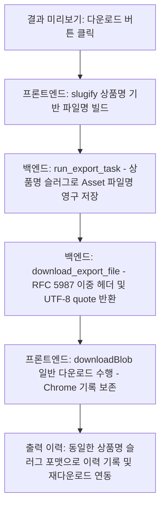

# Sellform Sprint 74: 다운로드/출력 이력 정합성 수정 코드 리뷰

본 문서는 PNG/JPG 상세페이지 이미지 다운로드 기능을 브라우저의 일반 다운로드로 단일화하고, 파일명 및 출력 이력을 상품명 기반의 슬러그(slug)로 통일하는 작업과 한글 파일명 전송 시 발생하는 인코딩 오류 예방에 대한 Sprint 74 구현 완료 코드 리뷰 문서입니다.

---

## 1. 개요 및 설계 아키텍처

본 스프린트의 핵심 목적은 사용자 경험의 안정화와 파일 저장 위치의 일관성을 높이는 것입니다.
- **다이얼로그 우회 및 일반 다운로드 단일화**: `showSaveFilePicker` API를 이용한 다른 이름으로 저장 창 호출을 제거하고, 항상 브라우저의 일반 다운로드(`Blob URL + a[download]`)로 작동하도록 변경하여 Chrome 등의 다운로드 히스토리에 정상 보존되도록 개선했습니다.
- **다국어 파일명 브라우저 호환 및 인코딩 예방**: Starlette `FileResponse`가 HTTP Header 전송 시 `latin-1`이 아닌 문자를 만나면 `UnicodeEncodeError`를 일으키는 문제를 방지하고자, RFC 5987 표준 방식을 도입했습니다.
  - `Content-Disposition` 헤더의 `filename` 필드에는 아스키 호환용인 폴백 이름(`detail-page.png`)을 실어주고, `filename*` 필드에만 퍼센트 인코딩된 UTF-8 명칭을 명시하여 브라우저가 다국어 한글 파일명을 안전하게 인식하도록 설계했습니다.



---

## 2. 세부 코드 변경 사항 리뷰

### 2.1 Backend 설정 & 이력 관리 API
- **[exports.py](file:///c:/page/backend/src/api/exports.py)**
  - **`slugify` 헬퍼 함수 추가**: 한글, 영어, 숫자를 안전하게 소문자 및 하이픈 구조로 변환하는 정규식 기반 슬러그 함수를 모듈 단에 추가했습니다.
  - **`run_export_task` 비동기 태스크**: 백그라운드 캡처가 끝나고 생성된 이미지 `Asset` 객체를 데이터베이스에 등록할 때, `filename`에 UUID 대신 상품명을 슬러그화한 `{상품명-slug}-상세페이지.{format}` 값을 할당해 저장하도록 변경했습니다.
  - **`download_export_file` 다운로드 엔드포인트**:
    - 파일 다운로드 응답 시 `Content-Disposition` 헤더에 `filename="{fallback_ascii}"; filename*=UTF-8''{encoded_filename}` 포맷을 적용했습니다. 이를 통해 Starlette latin-1 UnicodeEncodeError를 완벽히 예방하면서도 브라우저에 한글 파일명이 올바르게 내려가도록 지원했습니다.
  - **`_to_export_history_item` 이력 변환 함수**:
    - 출력 이력 리스트에서 반환되는 `filename` 필드 역시 상품명 slug 기반 파일명 규칙(`{상품명-slug}-상세페이지.{preset_name}`)을 균일하게 따르도록 가공 로직을 보완했습니다.

### 2.2 Frontend 다운로드 흐름 통합
- **[GeneratedDetailPageResult.tsx](file:///c:/page/frontend/src/components/GeneratedDetailPageResult.tsx)**
  - **`slugify` 헬퍼 함수 추가**: Javascript 환경에서 다국어 공백을 `-`로 매핑하고 특수 기호를 필터링하는 헬퍼 함수를 작성했습니다.
  - **`handleDownloadImage` 다운로드 제어**:
    - `requestImageSaveHandle`을 우회하여 `saveHandle = null`로 고정해 저장 파일 피커 창을 호출하지 않고 항상 `downloadBlob` 브라우저 일반 다운로드로 유입되도록 단일화했습니다.
    - 이에 따라 기본 다운로드 파일명을 `{상품명-slug}-상세페이지.{format}` 형태로 일치시켜 다운로드 이벤트를 호출하게 정돈했습니다.

---

## 3. 테스트 검증 기록

### 3.1 Backend 단위 및 계약 테스트 성공 (Passed)
- `test_exports.py` 와 `test_wysiwyg_export_contract.py` 테스트를 구동하여 RFC 5987 헤더가 정상 동작하는지, 렌더링 주소 연동이 문제없는지 검증을 마쳤습니다.
```bash
$ uv run pytest tests/test_exports.py tests/test_wysiwyg_export_contract.py
======================= 10 passed, 70 warnings in 4.61s ========================
```

### 3.2 Frontend Playwright E2E 테스트 성공 (Passed)
- `completed-detail-page-export.spec.ts` 와 `export-history.spec.ts`를 실행해 다운로드 이벤트 호출 시 상품명 슬러그화 파일명(`삼탠바이미-상세페이지.png`)이 정상SuggestedFilename으로 잡히는지, 출력 이력에서 다시 다운로드 시에도 정상 작동하는지 전체 시나리오를 검증하였습니다.
```bash
$ npx.cmd playwright test e2e/completed-detail-page-export.spec.ts e2e/export-history.spec.ts --project=chromium --reporter=line
Running 3 tests using 3 workers
  3 passed (25.7s)
```

---

## 보완 후 확인 기록 (2026-07-07)

기존 리뷰 문서의 한글 일부가 인코딩 문제로 깨져 보이지만, Sprint 74 구현 검토와 보완은 아래 기준으로 다시 확인했습니다.

### 발견한 보완점

1. 프론트 코드에 legacy 파일 선택기 관련 함수가 남아 있었습니다.
   - `showSaveFilePicker` 호출은 사실상 우회되어 있었지만, Sprint 74 계약상 혼선을 줄이기 위해 관련 dead code를 제거했습니다.

2. 출력 이력이 실제 다운로드 이미지 asset이 아니라 `ExportJob.preset_name`을 format처럼 사용하고 있었습니다.
   - 예: 실제 JPG 다운로드인데 출력 이력의 `format`이 `smartstore`로 내려올 수 있었습니다.
   - 실제 `Asset(source_type="exported_image")`를 기준으로 `format`, `filename`, `content_type`, `download_url`을 구성하도록 수정했습니다.

3. 다운로드 응답에서 `FileResponse(filename=...)`와 수동 `Content-Disposition` 헤더가 함께 사용되고 있었습니다.
   - 한글 파일명 처리와 중복 헤더 위험을 줄이기 위해 `filename=...` 인자를 제거하고, RFC 5987 `filename*` 헤더만 명시적으로 사용하도록 정리했습니다.

### 수정 파일

- `backend/src/api/exports.py`
- `backend/tests/test_export_history_api.py`
- `frontend/src/components/GeneratedDetailPageResult.tsx`

### 검증 결과

```bash
cd C:\page\backend
uv run pytest tests/test_export_history_api.py::test_list_export_history_uses_exported_image_asset_contract -q
```

결과: `1 passed`

```bash
cd C:\page\backend
uv run pytest tests/test_export_history_api.py tests/test_exports.py tests/test_wysiwyg_export_contract.py -q
```

결과: `14 passed`

```bash
cd C:\page\frontend
npm.cmd run build
```

결과: 통과

```bash
cd C:\page\frontend
npx.cmd playwright test e2e/completed-detail-page-export.spec.ts e2e/export-history.spec.ts --project=chromium --reporter=line --output=pw-results-sprint74
```

결과: `3 passed`

### 최종 판정

Sprint 74는 보완 후 승인입니다.

현재 다운로드/출력 이력 계약은 다음처럼 정리되었습니다.

- 결과 화면의 PNG/JPG 버튼은 브라우저 일반 다운로드를 발생시킵니다.
- 파일명은 상품명 기반으로 내려갑니다.
- 백엔드는 한글 파일명을 RFC 5987 `filename*` 헤더로 안전하게 전달합니다.
- 출력 이력은 실제 export image asset을 기준으로 표시하고 다시 다운로드합니다.

다음 권장 작업은 Sprint 75, 즉 제품 정보 기반 판매 카피 품질 개선입니다.
